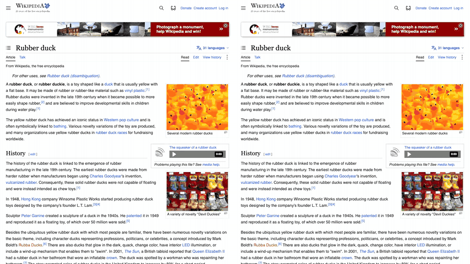

# laya-browser

**[agent-browser](https://github.com/vercel-labs/agent-browser), but selectors can be plain English, resolved on-device in milliseconds.**

`laya-browser` accepts every agent-browser command and passes it through unchanged. When a selector is English (`click "log in"`) instead of a `@ref` or CSS, a local [Laya](https://github.com/NandhaKishorM/laya) typed-decision model (via [laya-mlx](https://github.com/mizorewww/laya-mlx)) picks the matching element from the page snapshot. The agent skips the snapshot → read → pick-ref round-trip, and there's no LLM call or token cost.



*Wikiracing Rubber duck → Albert Einstein with links only. Left: agent-browser with Qwen3-30B-A3B (local Ollama, thinking off) choosing links, **26.3 s / 9 steps**. Right: laya-browser, **3.1 s / 5 steps**.*

## Install

Requires Apple Silicon, macOS 14+, Python 3.11+, and [agent-browser](https://github.com/vercel-labs/agent-browser) on `PATH`.

```bash
uv tool install git+https://github.com/Benny93/laya-browser   # or: git clone … && uv tool install --editable .
```

The first English selector downloads the model (`aac6fef/laya-mlx`, ~800 MB) from Hugging Face.

## Usage

```bash
laya-browser open https://httpbin.org/forms/post
laya-browser fill "telephone" 555-1234   # laya: 'telephone' -> @e3 textbox "Telephone: " (1.00)
laya-browser check "extra cheese"
laya-browser click "place the order"
laya-browser click @e3                   # refs, CSS, XPath, text= … pass straight through
laya-browser click "~button"             # leading ~ forces English for words that look like tag names
```

Each resolved pick is logged to stderr with its confidence, so an agent can fall back to a `@ref` when it's low.

**Resolution:**
1. Run `agent-browser snapshot -i`.
2. Try an unambiguous text match with no model: "log in" → `login`, "large pizza" → radio `Large`.
3. Otherwise run one batched Laya decision over the snapshot's elements: ~15 ms for ≤32 elements, a 32-per-chunk tournament above that.

A background daemon keeps the model loaded. It starts on first use (~1 s) and exits after 30 minutes idle.

**Selectors:** English is resolved in `click dblclick type fill hover focus check uncheck select upload download scrollintoview highlight wait drag is get`.

**Environment:**
- `LAYA_MODEL`: Hugging Face checkpoint to use (default `aac6fef/laya-mlx`).
- `AGENT_BROWSER`: path to the agent-browser binary.

## Benchmarks

```bash
uv sync
uv run python wikirace.py                 # 5 wikiracing tasks, local Laya only
uv run python sidebyside.py [task] [ollama-model]  # records docs/sidebyside.gif (needs Ollama + ffmpeg)
```

Wikiracing tasks follow [jev-for-chrome](https://github.com/chy4pro/jev-for-chrome)'s e2e format. Laya makes each decision over 50–730 links in ~50–300 ms. On route quality it reached **2 of 5** targets within 14 steps: it follows topical similarity and doesn't plan a route. See [benchmarks-wikirace.md](benchmarks-wikirace.md).

Measure with no other large model resident on the GPU. A loaded 24 GB Ollama model slowed Laya decisions roughly 10×.

## Limitations

- English isn't resolved inside `batch`.
- Put flags after positional arguments (`click "x" --flag`).
- Selector detection is a heuristic. A bare HTML tag name (`button`) stays CSS; use `~button` for English.
- Laya is a small decision model. Confidence isn't a guarantee, and vague targets on crowded pages can miss.

## Development

```bash
python test_laya_browser.py   # stdlib-only check, no model needed
```

## License

Apache-2.0; see [LICENSE](LICENSE) and [NOTICE](NOTICE). Laya weights are by Convai Innovations; laya-mlx is a community MLX port. Neither is affiliated with this project.
